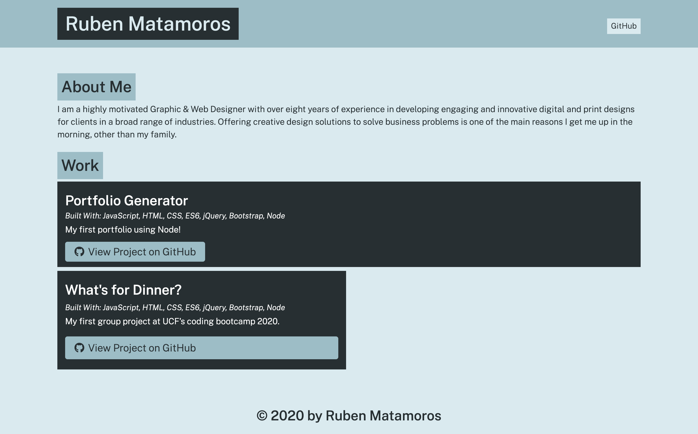

# Portfolio-Generator

## Purpose
This project displays the skills I need to be successful by building a program that creates an HTML portfolio page directly from the command line. I didn’t actually write any HTML or CSS. Instead, I used Node.js to dynamically generate the portfolio using input that the user enters when prompted.

## Contents
1. [Features](#features)
2. [Built With](#built-with)
3. [Application Mockup](#application-mockup)
4. [Contribution](#contribution)

## Features
* **PLEASE NOTE:** Because this is a Node.js application that runs from a machine and not a browser, I can't deploy this to GitHub pages. If anyone  wants to look at the application, you'll have to clone it to your own local machine and run it from there.
* Modularized my code into multiple files.
* Wrote my code using ES6+ concepts, such as let, const, and arrow functions.
* Used npm (Node Package Manager) to initialize a project and install and import Node.js modules.
* Built an interactive command-line application that processes user input using a third-party Node.js module.
* Used string literals to dynamically generate markdown from the command line.

## Built With
* Node.js
* JavaScript 
* CSS3
* HTML5
* BootStrap 4

## Application Mockup

[Deployed Repo](https://github.com/valiantcreative33/portfolio-generator)

## Contribution
* The Node packages and Inquirer.js installation was provided by [nmpjs.com](https://www.npmjs.com/package/inquirer).
* Node.js documentation was provided by [nodejs.org](https://nodejs.org/dist/latest-v12.x/docs/api/fs.html).
* Guidance and documentation provided by UCF's Coding Boot Camp.
* Everything else was built with lots of growing pains and caffeine by [Ruben Matamoros](https://valiantcreative33.github.io/valiantcreative33/).